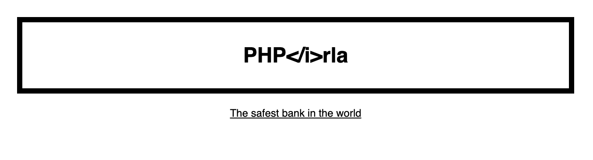

# PHP&lt;i/&gt;rla

Displaying some xss vulnerabilities on the average PHP website.

## Run the app

### `docker-compose up -d` and [open the browser](http://localhost:8080)

## Attacks

### XSS

-   [Steal cookie of a user](./attacks/xss/reflected-xss/get-user-cookie)
-   [Steal cookie of all users](./attacks/xss/reflected-xss/get-user-cookie)
-   [Transfer funds to your account](./attacks/xss/stored-xss/transfer-funds)

### Bruteforce

-   [Bruteforce the login page](./attacks/bruteforce/login)
